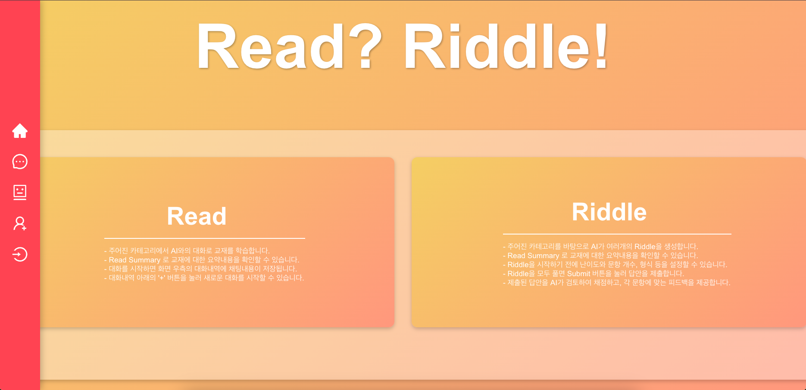
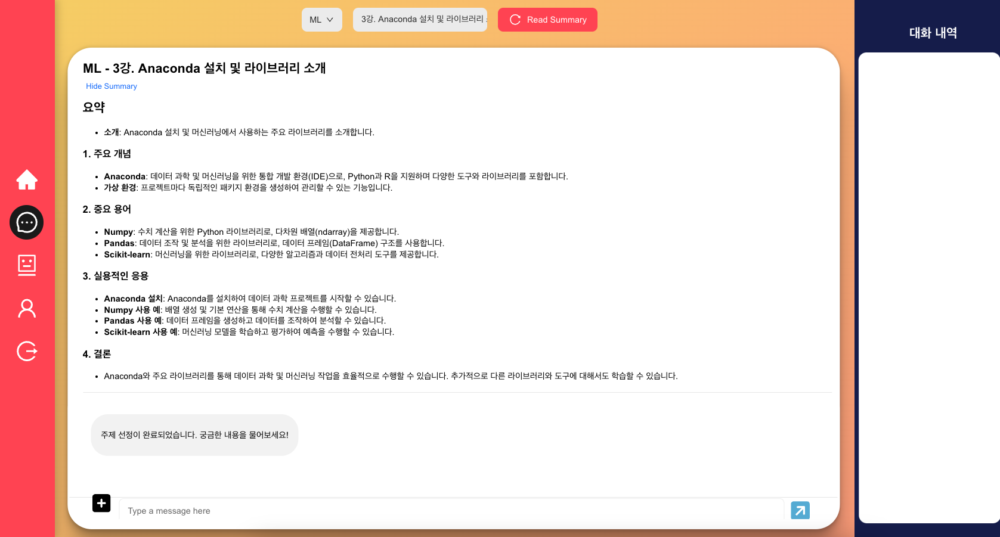
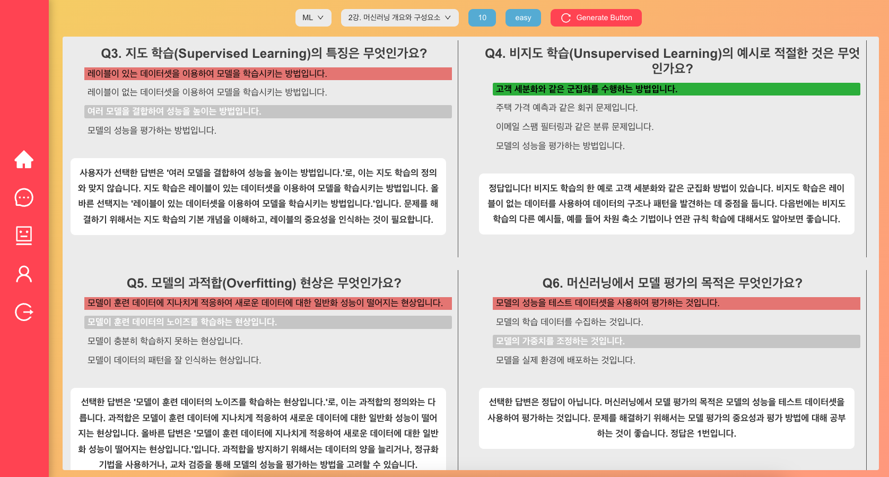
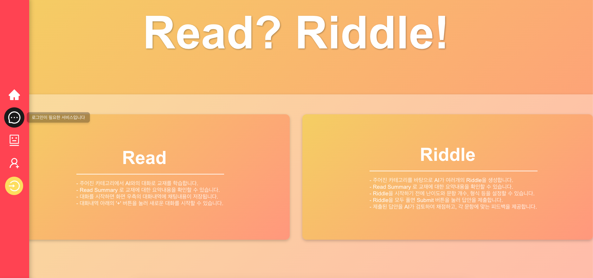
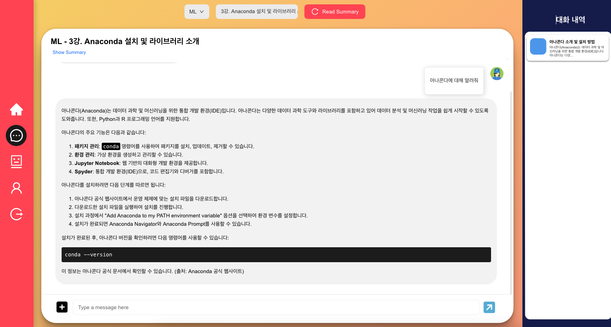
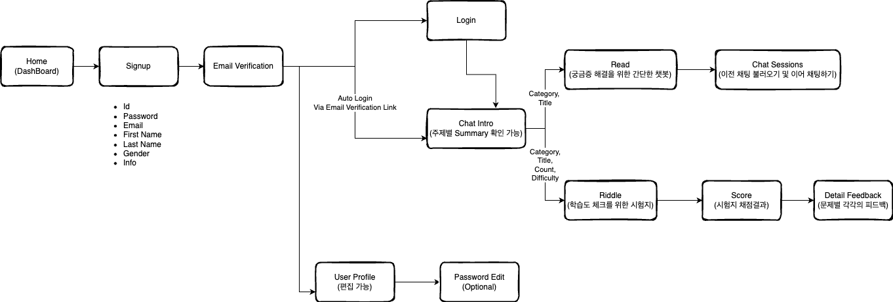
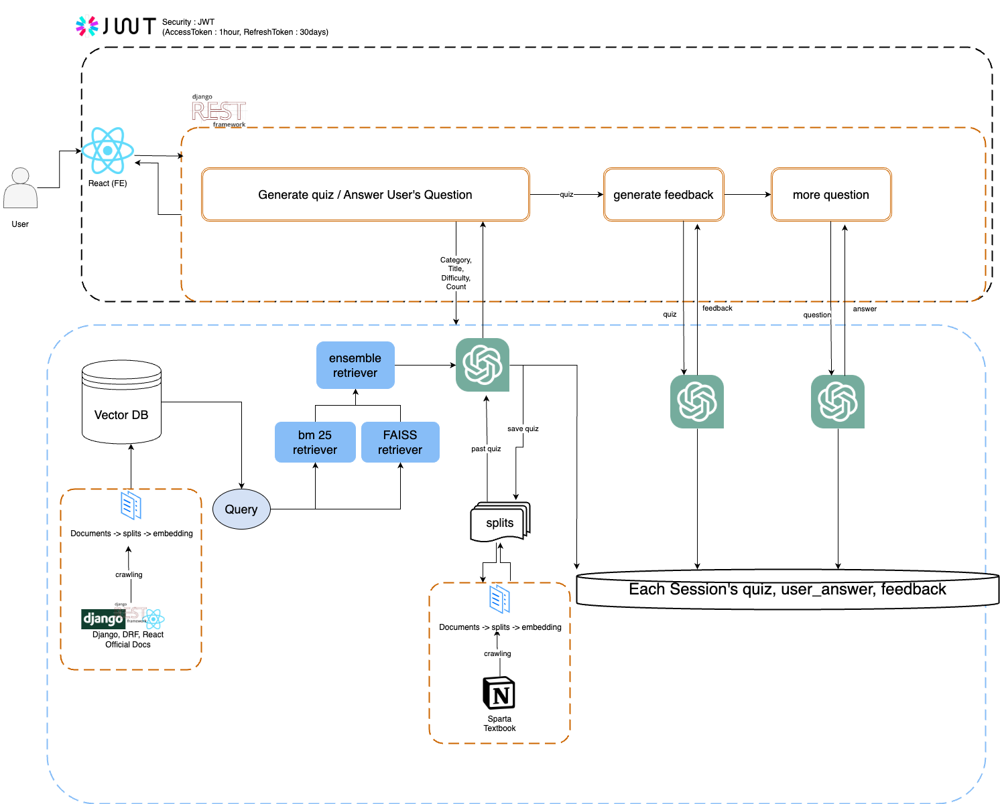

# 🤖 개발자들을 위한 학습용 AI 챗봇 ReadRiddle

## 📖 Navigation
1. [Introduction](#-introduction)
2. [How To Use](#-how-to-use)
3. [Key Function](#-key-function)
4. [Architecture](#-architecture)
5. [Trouble Shooting](#-trouble-shooting)
6. [Team](#-team)
---
## 👀 Introduction





ReadRiddle은 개발/AI 관련 학습을 원하는 사용자가 챗봇 / 시험지 형식을 통해 
원하는 지식을 학습하거나 학습한 지식의 깊이를 확인해 볼 수 있는 서비스를 제공합니다.


---
## 📣 How To Use

Local Server Version


1. 원격 저장소에 올라와 있는 코드 clone 받기 
```
# 백엔드
git clone https://github.com/devSpartaFinal/ReadRiddle.git

# 프론트엔드
git clone https://github.com/devSpartaFinal/client.git
```
2. 백엔드 라이브러리 사용을 위한 가상환경 세팅
```
python -m venv venv
```

3. 환경 활성화
```
source vevn/bin/activate
```

4. 필요한 라이브러리 & 모듈 다운로드 (백엔드/프론트엔드 각각의 디렉터리에서)
```
# 백엔드
pip install -r requirements.txt 

# 프론트엔드
npm install 
```

5. .env 설정
```
# open AI API Key, DRF 초기 secret Key, 본 서비스의 루트 이메일 계정 및 비밀번호
OPENAI_API_KEY, DRF_SECRET_KEY, HOSTUSER_EMAIL, HOSTUSER_EMAIL_PASSWORD

<예시>
DJANGO_SETTINGS_MODULE="coding_helper.settings"
REACT_APP_API_URL="http://localhost:8000"
POSTGRES_USER="user"
POSTGRES_PASSWORD="password"
POSTGRES_DB="postgres"
POSTGRES_HOST="db"
```

6. 실행 
```
# 백엔드
python manage.py runserge
  
# 프론트엔드
npm start

7. docker-compose로 실행 / 빌드 취소를 원할 경우 (docker-compose down)
docker-compose up --build

```

pip install channels
pip install channels_redis


---
## 🗝️ Key Function


### 🤖 RAG를 이용한 챗봇 기능
> - 사용자는 원하는 카테고리/주제를 선택해 문제를 통한 학습 이전에 간단한 궁금증을 해소하거나 주제 관련 요약을 제공받아 학습 방향을 설정할 수 있습니다.
> - 질문할 수 있는 범위는 AI 강의관련 내용, 강의 관련 오픈소스 코드, 웹 개발 프레임 워크 공식문서입니다.
> - 사용자는 채팅화면 오른쪽에 있는 채팅 세션 파트에서 이전 채팅 내용들을 불러올 수 있습니다.

   <details>
  <summary>동작화면</summary>

   
  </details>

### 📝 RAG를 이용한 문제 출제/피드백 기능
> - 사용자는 원하는 카테고리/주제/난이도/문제 갯수를 선택해 원하는 주제 내에서 문제를 받아 학습을 진행할 수 있습니다.
> - 출제할 수 있는 범위는 AI 강의관련 내용, 강의 관련 오픈소스 코드, 웹 개발 프레임 워크 공식문서입니다.
> - 문제 풀이 이후에는 사용자의 답변에 대한 피드백을 제공해 사용자의 원할한 학습을 유도합니다.

<details>
  <summary>동작화면</summary>

   
  </details>

### 🔐 JWT 로그인
> - 백엔드에서 설정할 쿠키에는 짧은 생명 주기의 AccessToken만 저장합니다.
> - 해당 AccessToken을 갱신할 때에는 accessToken을 디코딩하여 사용자를 인식한 후 사용자에 맞는 refreshToken을 DB에서 가져옵니다.
> - refreshToken 만료 기한 이전에 자동으로 accessToken을 자동 갱신하게 하기 위해 로그인할 때 발급되는 시점에서 프론트 측에서 로그인 시간을 기록해 둔 후 자동으로 백엔드 측에서 설정해둔 accessToken 만료 기한 이전에 refreshToken 갱신 API를 호출한 후 새로 발급된 accessToken을 프론트 측에 저장해 둬 로그인을 유지할 수 있게 됩니다.


<details>
  <summary>동작화면</summary>

   
  </details>


### 💬 Polling 방식을 활용한 실시간 채팅
> - 실시간으로 대화가 저장/관리가 가능합니다.
> - 각 채팅은 주지/카테고리 별로 선택할 수 있습니다.
> - 새로운 채팅방 생성 시/채팅방 선택 시에 해당 채팅방 위치로 자동 스크롤을 가능하게 합니다.
> - 코드와 일반 Text를 구분해 사용자에게 좋은 채팅 뷰를 제공하고자 합니다.

<details>
  <summary>동작화면</summary>

   
  </details>


Deployment Diagram


---
## 🔍 Architecture


---
## 💻 Trouble Shooting

<details>
  <summary> DBeaver 에서 docker-compose로 실행한 PostgresSQL DB 연결 시 EOFException 오류 발생</summary>

(원인) yml 파일에 설정된 포트번호에서 컨테이너 내부 포트를 PostgresSQL의 포트 5432번으로 설정하지 않아 발생 (해당 포트번호를 수정하려면 PostgresSQL의 기본 설정도 같이 변경해줘야 한다.) </br>
(수정) 외부에서 접근하는 호스트의 포트번호는 그대로 유지한 상태에서 컨테이너 내부 포트번호만 변경 5480:5480 --> 5480:5432
  </details>

<details>
  <summary> json 파일 로드 시 상대경로를 찾지 못하는 문제</summary>

```py
with open("references.json", 'r', encoding='utf-8') as file:
        data = json.load(file)
```
(원인) Django Framework 내부 파일의 경우, 기본 경로가 현재 경로가 아닌 프레임워크의 최상단 경로로 설정되어있어 발생 </br>
(수정) references.json 파일을 최상단 경로로 이동 후 해결
  </details>

  <details>
  <summary> 이메일 인증 기능 구현 시 인증메일을 전송하는 HOST 의 G메일(발신자) 로그인이 차단되는 현상</summary>

```bash
smtplib.SMTPAuthenticationError: (535, b'5.7.8 Username and Password not accepted.
```
(원인) 2025년 1월부터 구글의 인증정책이 변경되어 "보안 수준이 낮은 앱의 액세스" 를 활성화하는게 불가능하도록 변경됨
(수정) 해당 계정의 실제 비밀번호 대신 2차인증 후 앱 비밀번호를 입력하는 방식으로 변경
  </details>

  <details>
  <summary> Django 공식문서 크롤링 시, 코드내용이 추출되지 않는 현상</summary>

```html
<div class="highlight">
    <pre>
        <span></span>
        <span class="kn">from</span>
        <span class="nn">django.db</span>
        <span class="kn">import</span>
        <span class="n">models</span>
        ...
```
(원인) 위와 같이 코드 내용이 각 단어별로 span 태그에 분할되어 있어서 텍스트 추출 시 누락
(수정)  
```html
<div class="highlight"> 안의 <pre> 태그 추출 및 원본에 삽입  
- 실제 코드 내용만 텍스트로 추출  
- html 상의 <pre> 태그 내부를 실제 코드 내용으로 교체  
<이전 코드>
```html

```py
response = requests.get(url)
response.raise_for_status()  # HTTP 오류 발생 시 예외 발생
soup = BeautifulSoup(response.text, 'html.parser')
return soup.prettify()
```
<수정 코드>
```py
response = requests.get(url)
response.raise_for_status()
soup = BeautifulSoup(response.text, 'html.parser')

code_blocks = soup.find_all('div', class_='highlight')
for block in code_blocks:
pre_tag = block.find('pre')
if pre_tag:
        code_content = pre_tag.get_text()
        pre_tag.replace_with(f"\n<pre>{code_content}</pre>\n")

modified_html = soup.prettify()
return modified_html
```

  </details>

  <details>
  <summary> Django_DRF 문서 크롤링 중 코드 내용을 명시하는 code_snipet 태그가 적용되지 않는 문제</summary>

```py
response = requests.get(url)
response.raise_for_status()  # HTTP 오류 발생 시 예외 발생
soup = BeautifulSoup(response.text, "html.parser")

# <div class="prettyprint well"> 안의 <pre> 태그 추출 및 원본에 삽입
code_blocks = soup.find_all("pre", class_="prettyprint well")
for block in code_blocks:
# <code> 태그 안의 모든 내용을 추출
code_tag = block.find("code")
if code_tag:
code_content = code_tag.get_text()
code_tag.replace_with(f"\n<code_snipet>{code_content}</code_snipet>\n")

# 변경된 HTML 반환
modified_html = soup.prettify()
return modified_html
```
(원인) 
```py
soup = BeautifulSoup(response.text, "html.parser")
```
위 구문에서 div 태그의 class 속성은 그대로 남아있지만, pre 태그의 class 속성이 사라져서 code_blocks 자체가 생성되지 않았음
(수정)
pre 태그 안의 code 태그가 있는 경우에만 코드내용이 추출되므로, pre태그의 검색조건에서 class 구문 삭제
```py
code_blocks = soup.find_all("pre")
```
  </details>

<details>
  <summary> 회원가입 페이지에서 정상적인 가입 요청 시 오류 문구가 "회원가입 실패"로만 노출되는 현상</summary>

(원인) API 에 요청된 request.data 를 serializer가 검증하는 과정에서 검증 실패에 대한 안내문구가 없어서 발생
(수정) 검증에 대한 안내문구 추가 + 비밀번호 중복검증 삭제 + username 과 email 중복 검증 추가
  </details>
  <details>
  <summary> navigate메서드를 통해 변경된 React 페이지들이 유저의 최신 정보를 제대로 렌더링하지 못하는 현상</summary>

```js
<Route
path="/chats"
element={
<AuthProvider>
<ChatIntro />
</AuthProvider>
}
/>
```
AuthProvider를 불러오는 AuthContext.js 에서 유저 정보를 제대로 갱신하지 않아 문제 발생
(수정)
AuthContext.js 파일에 uselocation 설정을 추가하여 페이지가 변경될 때마다 현재 경로를 감지해서 useEffect 를 새로 로드
```js
import { useNavigate, useLocation } from "react-router-dom"; // useLocation 추가
...
const location = useLocation(); // 현재 경로 감지
...
  useEffect(() => {
    loadUserData();
  }, [location]); // location을 useEffect의 의존성 배열에 추가하여 페이지가 변경될 때마다 유저 정보를 새로 로드하도록 유도
```
  </details>
  <details>
  <summary> 사용자 로그인 후 페이지 갱신 시 로그인이 풀려버리는 현상</summary>

(원인 - 문제 코드)
아래 App.js 에서 useEffect 함수 중복호출  
최초에 정상적으로 accessToken을 체크하여 IsLoggedIn 변수를 갱신하였지만, 이후 선언된 useEffect에서 /after_email 경로가 아닌 경우에 쿠키의 "acceess" 변수를 체크하여 로그인 상태를 다시 갱신 --> 쿠키에는 access 관련 정보가 없으므로 로그인이 계속 풀리게 됨
```js
useEffect(() => {
      const token = getCookie("accessToken");
      setIsLoggedIn(!!token); // 토큰이 있으면 true, 없으면 false
    }, []);

useEffect(() => {
      if (window.location.pathname !== '/after_email') {
        const token = getCookie("access");
        setIsLoggedIn(!!token);
      }
    }, []);
```
(수정)
access 변수를 체크하는 useEffect 구문 삭제 후 해결
```js
useEffect(() => {
      const token = getCookie("accessToken");
      setIsLoggedIn(!!token); // 토큰이 있으면 true, 없으면 false
    }, []);
```
  </details>
  <details>
  <summary> db 컨테이너가 생성되기 전에 접속 시도</summary>

(원인) DRF을 담고 있는 web 컨테이너가 db 컨테이너가 생성되기 전에 접속 시도 </br>
(수정) 
- Dcodkerize 명령어로 대기 설정
- db 컨테이너의 포트가 열리기 전에 접근하면 대기, 30초가 지나도 열리지 않으면 실패로 판단
- Dockerfile 
```yaml
    RUN apt-get update && \
    # 패키지 목록을 업데이트
    apt-get install -y wget && \
    # wget 설치 / HTTP, HTTPS, FTP 에서 파일 다운로드 / -y 모두 확인
    wget https://github.com/jwilder/dockerize/releases/download/v0.6.1/dockerize-linux-amd64-v0.6.1.tar.gz && \
    tar -xvzf dockerize-linux-amd64-v0.6.1.tar.gz && \
    # tar : 압축 해제 / -x 압축 해제 /-v는 과정 표시 / -z는 .tar.gz 형식, -f 이름 지정
    mv dockerize /usr/local/bin/
    # mv 이동
```
- docker-compose.yml

```yaml
command: >
      sh -c "
      dockerize -wait tcp://db:5432 -timeout 30s &&
```

  </details>
  <details>
  <summary> delete요청의 body가 누락되는 문제</summary>

(원인) delete요청의 body의 입력 필드 및 예시가 UI에 표시되지 않는 문제 </br>
(수정) delete 의 request body는 지원하지 않는 것으로 확인

description에 상세하게 기술하는 것으로 대체
  </details>
  </details>
  <details>
  <summary> 채팅 컴포넌트 넘침 문제</summary>

(수정) 
1. 채팅 Container height 속성값 줄이기
2. 채팅 바로 위의 Container height 속성 % 줄이기, overflow: hidden 적용 
(부모 컨테이너를 넘어가는 것을 숨김)
  </details>
  <details>
  <summary> docker build 시 'ContainerConfig' 오류 발생</summary>

(원인) 
- KeyError: 'ContainerConfig’

- 원인 : 이전에 중단된 컨테이너나 이미지가 문제를 일으킴
</br>
(수정) docker 종료 후 docker-compose down 도 해주어야 함
  </details>

  </details>
  <details>
  <summary> Ddocker 빌드 시 pgAdmin에서 오류 발생</summary>

(원인)
 - [Errno 13] Permission denied: '/var/lib/pgadmin/sessions’
- 원인 : /var/lib/pgadmin/sessions 디렉터리에 대해 쓰기 권한이 없어서 발생한 문제
(수정) 
호스트 시스템의 디렉토리 권한을 변경하여 컨테이너가 사용할 수 있도록 설정
sudo chown -R 5050:5050 /home/ubuntu/ReadRiddle/DB_test/pgadmin/
  </details>
  <details>
  <summary> 디렉토리의 소유권 변경 명령어 실행 시 오류 발생</summary>

(원인) 
- chown: unknown user/group pgadmin:pgadmin

- 원인 : pgadmin:pgadmin 사용자가 존재하지 않기 때문

(수정) 
- 해결 (1)
    - `cat /etc/passwd` 명령어로 pgadmin 컨테이너에서 사용자를 확인
    - 결과 : `pgadmin:x:5050:0::/home/pgadmin:/sbin/nologin`

pgadmin 사용자가 실제로 컨테이너 내에 존재하는 것을 확인했지만, /sbin/nologin 쉘을 사용하고 있어, 이를 통해 로그인할 수 없는 상태. 이로 인해 직접적인 권한 수정이 어려움

- 해결 (2) : 호스트 시스템에서 해당 디렉토리의 권한을 수정
sudo chown -R 5050:5050 /home/ubuntu/ReadRiddle/DB_test/pgadmin/

  </details>
    </details>
  <details>
  <summary> docker build 시 PostgreSQL 서비스가 이미 포트 5432를 사용 중</summary>

(원인) Error starting userland proxy: listen tcp4 0.0.0.0:5432: bind: address already in use

- 원인 : PostgreSQL이 이미 실행 중이거나 다른 컨테이너가 해당 포트를 점유하고 있을 때 발생

(수정) 아래 명령어로 현재 포트 점유 확인 및 기존 PostgreSQL 서비스 중지.

```json
sudo netstat -tuln | grep 5432
sudo service postgresql stop
```

- 두 번째 명령어 실행 시 warning 발생

- Warning: The unit file, source configuration file or drop-ins of postgresql.service changed on disk. Run 'systemctl daemon-reload' to reload units.

- 원인 : postgresql.service의 설정 파일이 변경된 상태. 이를 반영하려면 systemctl daemon-reload 명령어를 실행하여 시스템의 서비스를 다시 로드해야 함

- 해결 : `sudo systemctl daemon-reload` 명령어로 시스템 서비스를 다시 로드한 후 다시 두 번째 명령어 실행
    - `sudo netstat -tuln | grep 5432` 명령어로 포트 점유 상태 확인 가능

- docker 종료 마다 `sudo systemctl stop postgresql` 로 호스트 시스템에서 PostgreSQL 서비스를 중지시켜야 함
`sudo lsof -i :5432` 로 5432 포트를 사용 중인 프로세스를 확인 가능
  </details>
  <details>
  <summary>  다시 build 시 2가지 오류 발생</summary>

(원인)
- 오류1 : error checking context: can't stat '/home/ubuntu/ReadRiddle/DB_test/data'   
ERROR: Service 'web' failed to build : Build failed
- 오류2 : error checking context: no permission to read from '/home/ubuntu/ReadRiddle/DB_test/pgadmin/pgadmin4.db'   
ERROR: Service 'web' failed to build : Build failed
- 원인 : Docker가 해당 디렉토리나 파일에 접근할 수 있는 권한이 없어서 해당 오류 발생

(수정) 
아래 명령어로 권한 부여(해당 디렉토리에 대해 각각 필요한 읽기/쓰기/실행 권한을 부여)
sudo chmod -R 755 /home/ubuntu/ReadRiddle/DB_test/data
sudo chmod 644 /home/ubuntu/ReadRiddle/DB_test/pgadmin/pgadmin4.db
  </details>
    </details>
  <details>
  <summary> 채팅형식 퀴즈 질문과 봇 메시지로 인식하지 않고 함께 전송하도록</summary>

(원인) 
피드백 생성 POST를 위해 사용자의 답변과 함께 직전 퀴즈 데이터가 들어가야 하는데 퀴즈 데이터가 들어가지 못하는 상황

```js
 const onSendMessage = (messageText) => {
    const newMessage = {
      id: messages.length + 1,
      text: messageText,
      author: 'User',
      
 setMessages([...messages, newMessage]);

<ChatForm onSendMessage={onSendMessage} />
```


(수정) input한 답변을 받는 form context에서 BotMessage도 함께 전달
```js
  
   const onSendMessage = (messageText) => {
    const newMessage = {
      id: messages.length + 1,
      text: messageText,
      author: 'User',
      author: "User",
    };

    const lastBotMessage = getLastBotMessage();

    const answerMessage = {
      id: Date.now() + 2,
      text: `user: ${messageText}, quiz: ${lastBotMessage ? lastBotMessage.text : "No bot response"}`,
      author: "USER_BOT",
    };
     setMessages((prevMessages) => [...prevMessages, newMessage]);

    return answerMessage;
     
     
     
           <ChatForm
              onSendMessage={(messageText) => {
                const answerMessage = onSendMessage(messageText);
                return answerMessage;
              }}
              lastBotMessage={getLastBotMessage()?.text || "No bot response"} // Use initial bot message for the first render
            />
```

  </details>
  <details>
  <summary> 채팅형식 퀴즈 첫 질문 답변 시에 질문 전달 안됨 오류</summary>

(원인) 피드백 생성 POST를 위해 사용자의 답변과 함께 퀴즈 데이터가 들어가야 하는데 이때 직전 퀴즈 데이터 중 최초의 퀴즈 데이터에 한해 들어가지 못하는 문제 

```js
 lastBotMessage={getLastBotMessage()?.text || "No bot response"} 
 
 # 채팅 폼 전송 시에          
 import React, { useRef, useState } from 'react';
	 const ChatForm = ({ onSendMessage, lastBotMessage }) => {

```
(수정) 
비동기적 봇 메시지 업데이트 → 동기적으로 업데이트 하도록 수정

```js
lastBotMessage={getLastBotMessage()?.text || "No bot response"}
              onBotMessage={onBotMessage}

# 채팅 폼 전송 시에

import React, { useRef, useState, useEffect } from 'react';
	const ChatForm = ({ onSendMessage, lastBotMessage, onBotMessage }) => { 


 useEffect(() => {
      setCurrentLastBotMessage(lastBotMessage);
    }, [lastBotMessage]);

```
  </details>
    </details>
  <details>
  <summary>같은 퀴즈 세션에 대해서만 답변, 결과가 업데이트 되던 문제</summary>

(원인) 같은 퀴즈 세션에 대해서만 답변, 결과가 업데이트 되던 문제
현재 백엔드에서 가져오는 id 값은 퀴즈 세션의 id값이 아닌 존재하지 않은 값이기 때문에 나오는 디폴트 값인 1이었습니다.
</br>
(수정) 현재 백엔드에서 가져오는 id 값은 퀴즈 세션의 id값이 아닌 존재하지 않은 값이기 때문에 나오는 디폴트 값인 1이었습니다.
즉, 백엔드 측에서 보내주는 id 값이 전체 퀴즈 세션의 id로 오해했기 때문에 발생했던 문제였습니다.

id를 실제 생성된 quiz의 id로 재설정해줘야 했습니다.
그 후 해당 id로 GET요청을 보내 안전하게 해당하는 퀴즈 세션의 정보를 가져올 수 있도록 수정했습니다. 
이를 무시하고 quiz.id나 [choice.id](http://choice.id/) 를 통해 POST, GET 요청을 날렸기 때문에 일부 요청의 경우 (특히나 보기 문항이 많은 4지선다 문제) 에서 다르게 채점되는 상황이 발생했었습니다.

때문에 프론트 측에서도 id가 아닌 number로 그 통일성을 유지해줍니다.

  </details>
  <details>
  <summary> 개별 피드백 화면 연결 못함 문제</summary>

(원인) 로직의 복잡성 때문에 프론트에서의 처리에 불편함을 겪었음
과거 개별 피드백 요청 시에 피드백만 나오는 구조였으며 애초에 질문을 생성할 때 모든 선지와 정답을 갖고 있어야 했음
(수정) 
- 개별 피드백 요청 시에만 response에서 정답을 가져옴
- 가시적으로 정답 여부를 표현하기 위해 배경 색으로 정답 구분

```js
const detail_response = await quizApiRequest.get(`/feedback/detail/${session_no}/`);
      const quizes = detail_response.data;

      const selectedAnswers = quizes.reduce((acc, quiz) => {
        const questionNumber = quiz.question.number;
        const correctChoice = quiz.choice.find(choice => choice.is_correct);

        acc[questionNumber] = correctChoice ? correctChoice.number : null;
        return acc;
      }, {});

      const userPreviousAnswers = quizes.reduce((acc, quiz) => {
        const questionNumber = quiz.question.number;
        acc[questionNumber] = quiz.user_answer?.selected_choice?.number || null;
        return acc;
      }, {});

      const userFeedbackDetails = quizes.reduce((acc, quiz) => {
        const questionNumber = quiz.question.number;
        acc[questionNumber] = quiz.feedback?.feedback || null;
        return acc;
      }, {});

      setHighlightedAnswers(selectedAnswers);
      setPreviousAnswers(userPreviousAnswers);
      setFeedbackDetails(userFeedbackDetails);
```

  </details>


  

---
## 🦾 Team
| 이름   | 역할                            |
|--------|---------------------------------|
| 박성진 | 초기 BE 설계, 공식문서 크롤링/전처리, 회원 관련기능 (이메일 인증, JWT 설계), FE 회원관련기능 개선|
| 윤수진 | PostGreSQL DB 구축, AWS 연동, 스파르타 문서 전처리, 데이터 전처리관련 모듈 개발, FE 전체 UI 및 style 개선|
| 구수연 | 초기 FE 설계, FE 퀴즈폼 개발, FE 대화세션 관련기능 개발, FE JWT 인증관련 개발 |
| 나영웅 |Docker CI/CD 설계, Quiz/QnA 관련 API 개발, RAG 모델 구축, JWT 인증방식 개선|


---
<details>
  <summary>Container</summary>

   # container

```bash
# 컨테이너 실행
docker-compose up --build

# 컨테이너 종료
ctrl + c

# 컨테이너 삭제
docker-compose down
```

```
project/
├── frontend/
│   ├── Dockerfile
│   ├── package.json
│   ├── package-lock.json
│   ├── src/
├── backend/
│   ├── Dockerfile
│   ├── manage.py
│   └── ...
├── db/
├── docker-compose.yml
```
  </details>

## 트러블 슈팅

[박성진]

1. 웹소켓 구현 시 FE에서 송신한 정보에 대해 경로를 찾지 못하는 현상
(에러 로그)
```bash
2025-01-17 17:24:54 Not Found: /ws/chat/test_room/
2025-01-17 17:24:54 [17/Jan/2025 17:24:54] "GET /ws/chat/test_room/ HTTP/1.1" 404 2655
```
(원인) Django의 runserver에서는 ASGI Websocket 을 완전히 지원하지 않기 때문
(수정) daphne을 통해서 ASGI Websocket 환경 구축
```bash
1. daphne 설치 및 등록(requirements.txt)
2. settings.py 의 INSTALLED_APPS 의 맨 윗부분에 추가
 - 다른 "django.contrib."로 구성된 APPS 이전에 실행되어야 하므로 순서가 선행되어야 한다
3. docker-compose 파일의 backend 커맨드라인 변경
<기존>
exec python manage.py runserver 0.0.0.0:8000 (마지막 라인)
<변경>
exec python manage.py runserver 0.0.0.0:8000 &&
exec daphne coding_helper.asgi:application --port 8000
```

2. 사용자가 다른 페이지로 이동하거나 로그아웃해서 채팅방 연결을 종료했을 때, 채팅 참여목록이 갱신되지 않는 현상
(원인) useEffect의 return에 선언한 아래 구문이 이미 소켓 연결이 종료된 시점에 호출되어서 메세지가 송신되지 않음
```js
if (socket.current.readyState === WebSocket.OPEN) {
    socket.current.send(JSON.stringify({ type: "leave", username }));
}
```

(수정) WebSocket 연결이 DISCONNECT 되기 전에 beforeunload 이벤트를 추가하여 페이지를 떠날 때 leave 메시지를 전송해서 참여목록 갱신
```js
const handleBeforeUnload = () => {
    if (socket.current && socket.current.readyState === WebSocket.OPEN) {
        socket.current.send(JSON.stringify({ type: "leave", username }));
    }
};
window.addEventListener("beforeunload", handleBeforeUnload);
return () => {
  // beforeunload 이벤트 제거
  window.removeEventListener("beforeunload", handleBeforeUnload);

  if (socket.current) {
      socket.current.close(); // disconnect 메서드 호출
  }
};
```