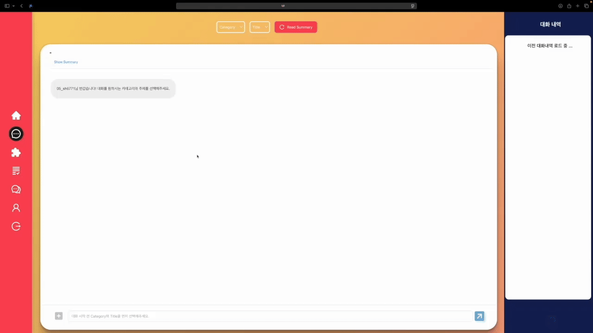
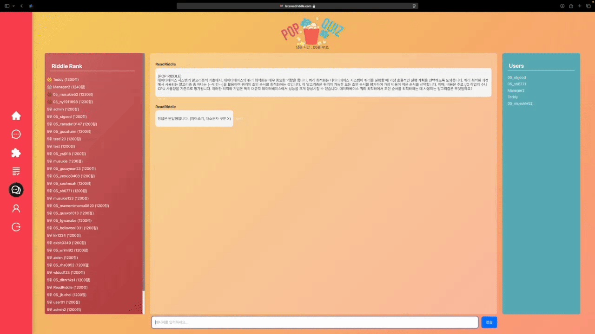
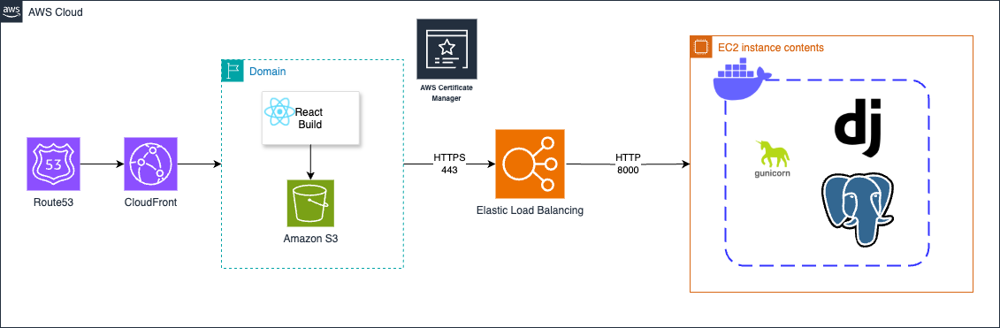
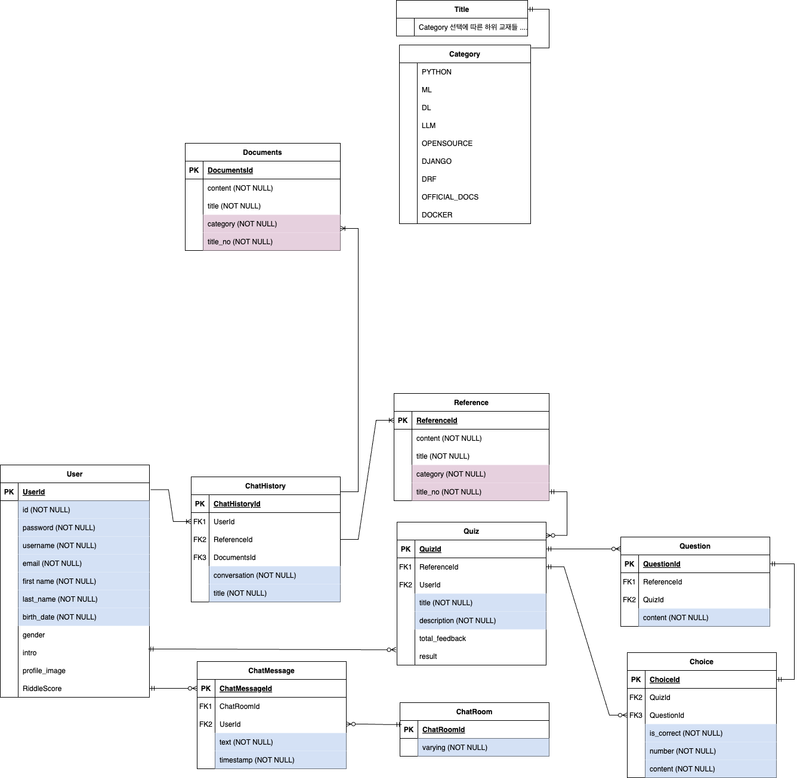

# 🤖 개발자들을 위한 학습용 AI 챗봇 ReadRiddle

### 📖 Navigation
1. [Introduction](#-introduction)
2. [Project Overview](#about-project)
3. [Goal](#-프로젝트-핵심-목표)
4. [Team](#-팀-구성-및-역할-배분)
5. [How To Use](#-how-to-use)
6. [Directory Structure](#-directory-structure)
7. [Key Summary](#key-summary)
8. [Architecture](#-architecture)
9. [Trouble Shooting](#-trouble-shooting)
---
## 👀 Introduction


ReadRiddle은 개발/AI 관련 학습을 원하는 사용자가 챗봇 / 시험지 형식을 통해 
원하는 지식을 학습하거나 학습한 지식의 깊이를 확인해 볼 수 있는 서비스를 제공합니다.

개발 기간 :  2024년 12월 30일 ~ 2025년 1월 31일


---
<a id="about-project"></a>
## ✍️ 프로젝트 개요

#### 프로젝트 주제: 
개발자들을 위한 학습용 AI 챗봇

#### 선정 배경:
이번 스파르타 과정에서 저희가 배웠던 여러가지 내용들을 복습하는데 활용하는 AI 챗봇을 개발하면 유용할 것 같다는 생각에, 해당 자료들을 바탕으로 AI가 퀴즈를 내고 사용자가 정답을 입력하면 이에 대해 피드백해주는 학습용 AI 모델을 개발하게 되었습니다.
여기에 좀 더 확장성을 고려하여 오픈소스와 공식문서(Django, DRF, React) 를 참고자료(RAG)로 사용하는 QnA 용 AI 챗봇을 추가해서 퀴즈와 학습을 병행할 수 있도록 했습니다.

#### 기획 의도:
학습 내용을 기반으로 퀴즈를 제공하고 피드백을 통해 학습 효율을 높이는 학습 보조 AI를 개발합니다.
주제 및 교재 선택, 피드백 제공 등 다양한 기능을 통해 사용자 편의성을 높였습니다.
특화 포인트 및 차별화된 내용:
RAG(Relevant Answer Generation) 모델 기반으로 강의 자료를 활용해 퀴즈와 피드백을 생성하고 유저의 질문에 적절히 답변하는 기능을 제공합니다.
대화 세션 관리와 대화 기록 저장을 통해 학습 진척도를 추적할 수 있습니다.
웹소켓을 활용한 사용자 간 실시간 단체 채팅과 POP QUIZ 및 랭크 시스템을 구현하였습니다.


---

## ❕ 프로젝트 핵심 목표
* 저희 프로젝트의 목적은

개발 중에 떠오르는 궁금증을 공식문서나 스파르타 교재를 기반으로 검증된 데이터를 얻을 수 있게 해주는 챗봇기능,
복습 학습을 진행할 수 있는 문제집 및 채점 기능,
주제에 대한 간단한 요약본을 받아볼 수 있는 기능,
알고리즘 문제에 대한 실시간 단체 퀴즈 채팅 기능을 제공하여 
개발자들 및 스파르타 수강생들의 흥미를 자극하며 개발 학습을 도와줄 수 있도록 설계되었습니다.

---

## 🦾 팀 구성 및 역할 배분
<table style="width: 100%; text-align: center;">
  <tr>
     <td style="text-align: center;"></td>
    <td style="text-align: center;"></td>
     <td style="text-align: center;"></td>
     <td style="text-align: center;"></td>
  </tr>
  <tr>
     <td style="text-align: center;">박성진</td>
     <td style="text-align: center;">윤수진</td>
     <td style="text-align: center;">구수연</td>
     <td style="text-align: center;">나영웅</td>
  </tr>
  <tr>
     <td style="text-align: center;">
      초기 BE 설계<br>
      공식문서 크롤링/전처리<br>
      이메일 인증<br>
      JWT 설계<br>
      FE 홈/프로필/대화세션 UI 개선 및 버그수정<br>
      웹소켓 연결<br>
      단체 POP QUIZ 개발
    </td>
     <td style="text-align: center;">
      PostGreSQL DB 구축<br>
      AWS 연동<br>
      스파르타 문서 전처리<br>
      데이터 전처리 관련 모듈 개발<br>
      FE 전체 UI 및 style 개선<br>
      피드백 결과페이지 개발
    </td>
     <td style="text-align: center;">
      초기 FE 설계<br>
      FE 퀴즈폼<br>
      AI 챗폼 개발<br>
      FE 대화세션 기능 개발<br>
      FE JWT 인증관련 개발<br>
      AWS 배포<br>
      QUIZ LLM 개선<br>
      소셜 로그인 기능
    </td>
     <td style="text-align: center;">
      Quiz/QnA 관련 API 개발<br>
      Docker<br>
      RAG 모델 구축<br>
      JWT 인증방식 개선<br>
      LLM 개발 및 개선<br>
      소셜 로그인 기능
    </td>
  </tr>
</table>


- 협업 도구
  - Github
  - Slack
  - Notion
  - Figma
- 버전관리
  - Git


---
## 📣 How To Use

👇 ReadRiddle 사이트 접속 👇 </br>

https://www.letsreadriddle.com/home


<details>
  <summary>Local Server Version</summary>

   1. 원격 저장소에 올라와 있는 코드 clone 받기 
```
# Docker
git clone https://github.com/devSpartaFinal/container.git
```
2-1. Backend .env 설정 (로컬)
```
OPENAI_API_KEY= {your openAPI key}
DRF_SECRET_KEY= {your DRF secret key}
DJANGO_SETTINGS_MODULE="coding_helper.settings"

HOSTUSER_EMAIL= {write your e-mail address that will be used for sending verification mails to users.}
HOSTUSER_EMAIL_PASSWORD= {write your e-mail password in API password type.}

POSTGRES_USER= {write your postgres user ID}
POSTGRES_PASSWORD= {write your postgres account password}
POSTGRES_DB= "postgres"
POSTGRES_HOST= "db"

GOOGLE_OAUTH_CLIENT_ID= {write your google client ID}
GOOGLE_OAUTH_CLIENT_SECRET= {write your google client secret key}
GOOGLE_OAUTH_CALLBACK_URL= "http://localhost:3000/google/login"
```

2-2. Frontend .env 설정 (로컬)
```
REACT_APP_BASE_URL=http://localhost:8000
REACT_APP_WS_BASE_URL=ws://localhost:8000
```

3. 실행 
```
docker-compose up --build
```

  </details>

---

## 🔍 Directory Structure

- docker로 백엔드, 프론트엔드 함께 실행 (로컬)

```
.
├── backend                   # 서버 측 애플리케이션 코드
│   ├── accounts              # 사용자 계정 관련 모듈
│   ├── chat                  # 실시간 단체 퀴즈 채팅 기능 관련 모듈
│   ├── chatbot               # 챗봇 기능 구현 모듈
│   ├── coding_helper         # Setting 관련 모듈
│   ├── quizbot               # 퀴즈봇 관련 모듈
│   ├── docker_test.md        # Docker 관련 테스트 문서
│   ├── Dockerfile            # 백엔드 Docker 설정 파일
│   ├── manage.py             # Django 관리 스크립트
│   └── requirements.txt      # Python 패키지 의존성 목록
├── db                        # 데이터베이스 관련 파일 (스키마, 설정 등)
├── frontend                  # 클라이언트 측 애플리케이션 코드
│   ├── public                # 정적 파일 (HTML, 이미지 등)
│   ├── src                   # React 소스 코드
│   │   ├── assets            # 정적 리소스 (이미지, 폰트 등)
│   │   ├── components        # React 컴포넌트 모음
│   │   ├── context           # 전역 상태 관리 Context API 관련 파일
│   │   ├── hooks             # React 커스텀 훅 모음
│   │   ├── styled            # 스타일링 관련 파일
│   │   ├── apiFeedbackRequest.js # API 피드백 요청 모듈
│   │   ├── apiRequest.js     # API 요청 처리 모듈
│   │   ├── App.css           # App 컴포넌트의 스타일 파일
│   │   ├── App.js            # 메인 React 컴포넌트
│   │   ├── index.css         # 전역 스타일 파일
│   │   ├── index.js          # React 엔트리포인트
│   ├── .gitignore            # Git에서 제외할 파일/폴더 설정
│   ├── Dockerfile            # 프론트엔드 Docker 설정 파일
│   ├── package.json          # Node.js 패키지 설정 및 의존성 목록
│   ├── yarn.lock             # Yarn 패키지 버전 고정 파일
│   ├── img                   # 이미지 파일 모음
├── docker-compose.yml        # Docker Compose 구성 파일
└── README.md                 # 프로젝트 설명 및 실행 가이드
```

---

<a id="key-summary"></a>
## 🔑 Key Summary


### 🤖 RAG를 이용한 챗봇 기능 & 💬 Polling 실시간 채팅방식
> - 사용자는 원하는 카테고리/주제를 선택해 문제를 통한 학습 이전에 간단한 궁금증을 해소하거나 주제 관련 요약을 제공받아 학습 방향을 설정할 수 있습니다.
> - 질문할 수 있는 범위는 AI 강의관련 내용, 강의 관련 오픈소스 코드, 웹 개발 프레임 워크 공식문서입니다.
> - 사용자는 채팅화면 오른쪽에 있는 채팅 세션 파트에서 이전 채팅 내용들을 불러올 수 있습니다.
> - 실시간으로 대화가 저장/관리가 가능합니다.
> - 각 채팅은 주지/카테고리 별로 선택할 수 있습니다.
> - 새로운 채팅방 생성 시/채팅방 선택 시에 해당 채팅방 위치로 자동 스크롤을 가능하게 합니다.
> - 코드와 일반 Text를 구분해 사용자에게 좋은 채팅 뷰를 제공하고자 합니다.

   <details>
  <summary>동작화면</summary>

   
  </details>

### 📝 RAG를 이용한 문제 출제/피드백 기능
> - 사용자는 원하는 카테고리/주제/난이도/문제 갯수를 선택해 원하는 주제 내에서 문제를 받아 학습을 진행할 수 있습니다.
> - 출제할 수 있는 범위는 AI 강의관련 내용, 강의 관련 오픈소스 코드, 웹 개발 프레임 워크 공식문서입니다.
> - 문제 풀이 이후에는 사용자의 답변에 대한 피드백을 제공해 사용자의 원할한 학습을 유도합니다.

<details>
  <summary>동작화면</summary>

   
  </details>

### 🔐 JWT 인증 & 구글 소셜 로그인
> - 백엔드에서 설정할 쿠키에는 짧은 생명 주기의 AccessToken만 저장합니다.
> - 해당 AccessToken을 갱신할 때에는 accessToken을 디코딩하여 사용자를 인식한 후 사용자에 맞는 refreshToken을 DB에서 가져옵니다.
> - refreshToken 만료 기한 이전에 자동으로 accessToken을 자동 갱신하게 하기 위해 로그인할 때 발급되는 시점에서 프론트 측에서 로그인 시간을 기록해 둔 후 자동으로 백엔드 측에서 설정해둔 accessToken 만료 기한 이전에 refreshToken 갱신 API를 호출한 후 새로 발급된 accessToken을 프론트 측에 저장해 둬 로그인을 유지할 수 있게 됩니다.
> - 구글에서 Cloud 프로젝트 생성 후 로그인 관련 설정을 해줍니다.
> - 해당 설정은 서버 측에서 먼저 완료를 해둔 후 구글 인증 후 로그인 후 리다이렉트 될 프론트엔드의 페이지를 설정해두어 해당 페이지에서 인증 관련 정보를 가져와 정상적으로 소셜 로그인이 진행되도록 합니다.

<details>
  <summary>동작화면</summary>

   
  </details>


### 💬 WebSocket 방식을 활용한 실시간 알고리즘 단체 채팅 퀴즈
> - redis 서버를 활용하여 각 클라이언트와 서버간의 웹소켓 방식을 구현했습니다.
> - 정해진 시간마다 채팅창에 POP QUIZ가 생성되면, 유저들은 화면을 보고 퀴즈를 풀게됩니다.
> - 문제를 먼저 맞춘 유저는 RiddleScore를 획득하고, 왼쪽 랭킹판에 점수가 갱신됩니다.
> - 제한시간 내에 참여자들이 모두 문제를 맞추지 못한 경우, ReadRiddle이 정답을 공개하고 다음 QUIZ까지 대기시간이 적용됩니다.


<details>
  <summary>동작화면</summary>

   
  </details>


### ☁️ 프론트엔드 & 백엔드 안정적이고 독립적인 운영환경 구축 
> - S3 : 
S3는 정적 웹 페이지를 호스팅하는 데 매우 저렴한 옵션이며, 사용량 기반 과금이라 초기 비용 부담이 적은 선택이었습니다.또한 트래픽이 증가해도 S3는 자동으로 확장되므로 따로 서버 관리 없이 대응할 수 있게 되었습니다.
> - CloudFront ,ROUTE53 : 
S3로 배포한 프론트엔드 컨텐츠를 전 세계 엣지 로케이션을 활용해 지연 시간을 최소화했으며 정적 컨텐츠를 캐시해 원본 서버의 부하를 감소시켰습니다.
> - ELB : 
웹서버 Nginx를 설정하여 포트 포워딩을 구성할 수도 있었지만, 보다 쉽고 간편한 방법으로 ELB의 포트 포워딩 기능을 활용하여 배포된 EC2 인스턴스의 내부 및 외부 데이터 전송 방식을 효과적으로 조정했습니다.
> - EC2 - T3 SMALL : 
여러가지 인스턴스 스펙으로 테스트 해보던 중에 여러명의 사용자가 접속할 경우 동시 다발적인 LLM응답 생성에 대응할 수 있으며 현재 트래픽에서 CPU 크레딧이 여유로운 T3 small 모델을 사용했습니다.
지속가능하면서 과금되지 않을 스펙의 EC2 인스턴스를 구동하게 되었습니다.
> - HTTPS 배포: 
보안 강화를 위해 HTTPS 프로토콜을 사용하여 안전한 연결을 보장하며, SSL 인증서를 설정하여 데이터를 암호화하고, 사용자의 개인정보 보호를 최우선으로 고려한 배포 환경을 구성했습니다.


---
## 🔍 Architecture


### Deployment Diagram


### Cloud Diagram



### ERD


---
## 💻 Trouble Shooting


> 박성진
<details>
  <summary> DBeaver 에서 docker-compose로 실행한 PostgresSQL DB 연결 시 EOFException 오류 발생</summary>

(원인) yml 파일에 설정된 포트번호에서 컨테이너 내부 포트를 PostgresSQL의 포트 5432번으로 설정하지 않아 발생 (해당 포트번호를 수정하려면 PostgresSQL의 기본 설정도 같이 변경해줘야 한다.) </br>
(수정) 외부에서 접근하는 호스트의 포트번호는 그대로 유지한 상태에서 컨테이너 내부 포트번호만 변경 5480:5480 --> 5480:5432
  </details>

<details>
  <summary> json 파일 로드 시 상대경로를 찾지 못하는 문제</summary>

```py
with open("references.json", 'r', encoding='utf-8') as file:
        data = json.load(file)
```
(원인) Django Framework 내부 파일의 경우, 기본 경로가 현재 경로가 아닌 프레임워크의 최상단 경로로 설정되어있어 발생 </br>
(수정) references.json 파일을 최상단 경로로 이동 후 해결
  </details>

  <details>
  <summary> 이메일 인증 기능 구현 시 인증메일을 전송하는 HOST 의 G메일(발신자) 로그인이 차단되는 현상</summary>

```bash
smtplib.SMTPAuthenticationError: (535, b'5.7.8 Username and Password not accepted.
```
(원인) 2025년 1월부터 구글의 인증정책이 변경되어 "보안 수준이 낮은 앱의 액세스" 를 활성화하는게 불가능하도록 변경됨
(수정) 해당 계정의 실제 비밀번호 대신 2차인증 후 앱 비밀번호를 입력하는 방식으로 변경
  </details>

  <details>
  <summary> Django 공식문서 크롤링 시, 코드내용이 추출되지 않는 현상</summary>

```html
<div class="highlight">
    <pre>
        <span></span>
        <span class="kn">from</span>
        <span class="nn">django.db</span>
        <span class="kn">import</span>
        <span class="n">models</span>
        ...
```
(원인) 위와 같이 코드 내용이 각 단어별로 span 태그에 분할되어 있어서 텍스트 추출 시 누락
(수정)  
```html
<div class="highlight"> 안의 <pre> 태그 추출 및 원본에 삽입  
- 실제 코드 내용만 텍스트로 추출  
- html 상의 <pre> 태그 내부를 실제 코드 내용으로 교체  
<이전 코드>
```html

```py
response = requests.get(url)
response.raise_for_status()  # HTTP 오류 발생 시 예외 발생
soup = BeautifulSoup(response.text, 'html.parser')
return soup.prettify()
```
<수정 코드>
```py
response = requests.get(url)
response.raise_for_status()
soup = BeautifulSoup(response.text, 'html.parser')

code_blocks = soup.find_all('div', class_='highlight')
for block in code_blocks:
pre_tag = block.find('pre')
if pre_tag:
        code_content = pre_tag.get_text()
        pre_tag.replace_with(f"\n<pre>{code_content}</pre>\n")

modified_html = soup.prettify()
return modified_html
```

  </details>

  <details>
  <summary> Django_DRF 문서 크롤링 중 코드 내용을 명시하는 code_snipet 태그가 적용되지 않는 문제</summary>

```py
response = requests.get(url)
response.raise_for_status()  # HTTP 오류 발생 시 예외 발생
soup = BeautifulSoup(response.text, "html.parser")

# <div class="prettyprint well"> 안의 <pre> 태그 추출 및 원본에 삽입
code_blocks = soup.find_all("pre", class_="prettyprint well")
for block in code_blocks:
# <code> 태그 안의 모든 내용을 추출
code_tag = block.find("code")
if code_tag:
code_content = code_tag.get_text()
code_tag.replace_with(f"\n<code_snipet>{code_content}</code_snipet>\n")

# 변경된 HTML 반환
modified_html = soup.prettify()
return modified_html
```
(원인) 
```py
soup = BeautifulSoup(response.text, "html.parser")
```
위 구문에서 div 태그의 class 속성은 그대로 남아있지만, pre 태그의 class 속성이 사라져서 code_blocks 자체가 생성되지 않았음
(수정)
pre 태그 안의 code 태그가 있는 경우에만 코드내용이 추출되므로, pre태그의 검색조건에서 class 구문 삭제
```py
code_blocks = soup.find_all("pre")
```
  </details>


<details>
  <summary> 웹소켓 구현 시 FE에서 송신한 정보에 대해 경로를 찾지 못하는 현상</summary>

   ```bash
2025-01-17 17:24:54 Not Found: /ws/chat/test_room/
2025-01-17 17:24:54 [17/Jan/2025 17:24:54] "GET /ws/chat/test_room/ HTTP/1.1" 404 2655
```
(원인) Django의 runserver에서는 ASGI Websocket 을 완전히 지원하지 않기 때문
(수정) daphne을 통해서 ASGI Websocket 환경 구축
```bash
1. daphne 설치 및 등록(requirements.txt)
2. settings.py 의 INSTALLED_APPS 의 맨 윗부분에 추가
 - 다른 "django.contrib."로 구성된 APPS 이전에 실행되어야 하므로 순서가 선행되어야 한다
3. docker-compose 파일의 backend 커맨드라인 변경
<기존>
exec python manage.py runserver 0.0.0.0:8000 (마지막 라인)
<변경>
exec python manage.py runserver 0.0.0.0:8000 &&
exec daphne coding_helper.asgi:application --port 8000
```
  </details>


  <details>
  <summary> 특정 타입에 대한 group_send 를 보냈을 때, 프론트에서 해당 타입에 대한 처리를 선언해도 처리가 되지 않는현상</summary>

  (에러코드) : No handler for message type pop_quiz_result
```javascript
# BE
if self.pop_quiz_active and message.lower() == "a":
  print("\nTeddy : 정답!\n")
  self.pop_quiz_active = False  # POP QUIZ 비활성화
  # 정답 알림 브로드캐스트
  await self.channel_layer.group_send(
      self.room_group_name,
      {
          "type": "pop_quiz_result",
          "message": f"{username}님이 정답을 맞췄습니다!",
          "username": username,
          "timestamp": timestamp,
      },
  )
  return

# FE
socket.current.onmessage = (event) => {
    const data = JSON.parse(event.data);
    // 일반 메시지 수신
    if (data.type === "user_message") {
        setMessages((prevMessages) => [...prevMessages, data]);
    }
    // 참여자 목록 수신
    else if (data.type === "participants") {
        setParticipants(data.participants);
    }
    // POP QUIZ 결과 처리
    else if (data.type === "pop_quiz_result") {
        setMessages((prevMessages) => [...prevMessages, data]);
        setPopQuizActive(false); // POP QUIZ 비활성화
    }
};
```

(원인) 
1. self.channel_layer.group_send로 전송된 메시지는 type 필드의 값을 기준으로 ChatConsumer 클래스의 메서드를 호출 (예: type: "pop_quiz_result"는 pop_quiz_result 메서드를 찾음.)
2. pop_quiz_result 메서드가 정의되지 않았다면 에러가 발생.

(수정)
서버 코드에 pop_quiz_result 메서드를 추가하여 처리
```py
class ChatConsumer(AsyncWebsocketConsumer):
  # 기존 메서드 생략...
  async def pop_quiz_result(self, event):
      """
      Handles 'pop_quiz_result' messages sent to the group.
      """
      message = event["message"]
      username = event["username"]
      timestamp = event["timestamp"]

      # 클라이언트로 메시지 전송
      await self.send(text_data=json.dumps({
          "type": "pop_quiz_result",  # 클라이언트가 인식할 메시지 타입
          "message": message,
          "username": username,
          "timestamp": timestamp,
      }))
```

  </details>


   <details>
  <summary> 동일한 값을 나타내는 두 변수에 대해 조건문 처리 과정이 상이한 현상
(문제 코드)</summary>

   ```js
if (popQuizTimeLeft <= 1 && !popQuizActive) { 
```
(원인) setPopQuizTimeLeft(timeToNextQuiz / 1000); 로 업데이트된 상태 업데이트는 즉시 적용되지 않고 React의 렌더링 사이클에 따라 다음 렌더링에서 업데이트된 값이 적용되는 비동기 변수이기 떄문에 발생.
(수정) 비동기 변수가 아닌 실제 변수를 사용하여 해결
```js
if (timeToNextQuiz <= 1 && !popQuizActive) { 
```


  </details>


  <details>
  <summary> 단체 퀴즈 채팅방에 QUIZ가 참여자 수만큼 출력되는 문제</summary>

(문제 코드)
```py
if data["type"] == "pop_quiz_active":
  # 클라이언트에서 POP QUIZ 활성화 메시지 수신
      ChatConsumer.pop_quiz_active = data["active"]
      print(f"POP QUIZ active state updated: {ChatConsumer.pop_quiz_active}")
      
      # 퀴즈 브로드캐스트
      if data['active'] == True:    
        await self.channel_layer.group_send(
            self.room_group_name,
            {
                "type": "quiz_broadcast",
                "message": ChatConsumer.question,
                "username": "ReadRiddle",
            }
        )
        await self.channel_layer.group_send(
            self.room_group_name,
            {
                "type": "quiz_intro",
                "message": "문제의 보기 번호를 정답으로 입력하세요!",
                "username": "ReadRiddle",
            }
        )
      return
```
(원인) POP QUIZ 생성시간이 되었을 때, 퀴즈를 Broadcast 하는 과정에서 모든 참여자의 인원수만큼 문제가 출력

(수정)
1. isOwner 로 방이 최초 생성되었을 때 방장을 나타내는 변수 설정. 이후 isOwner 로 설정된 유저가 대화방을 떠날 떄(웹소켓이 DISCONNECT) 다른 참여자들 그룹 중 가장 먼저 입장한 유저의 isOwner 값 True 로 변경
```py
elif data["type"] == "join":
  # 클라이언트가 보낸 join 메시지 처리
  self.isOwner = False
  self.pop_quiz_active = False
  username = data["myusername"]
  print(f"User {username} joined the room.")

  # 참여자 목록에 추가
  if not hasattr(self.channel_layer, "participants"):
      self.channel_layer.participants = set()
      print(f"participants 그룹이 생성되었습니다.")
      self.isOwner = True # 방장 여부
      print(f"{username} 가 방장이 되었습니다.")
  self.channel_layer.participants.add(username)

...

# 남아있는 참여자가 있다면 새로운 방장을 지정
  other_participants = [
      participant for participant in self.channel_layer.participants
      if participant != data["myusername"]
  ]
  if other_participants and self.isOwner:
      print(f"방장 {username} 이 방을 나갔습니다.")
      new_owner = other_participants[0]  # 첫번째 참여자 선택
      print(f"New owner assigned: {new_owner}")
      # 새로운 방장에게 owner 권한 부여 메시지 전송
      await self.channel_layer.group_send(
          self.room_group_name,
          {
              "type": "assign_owner",
              "new_owner": new_owner,
          }
      )
  elif not other_participants:
      del self.channel_layer.participants
      print("참여자가 없어 participants 그룹이 삭제되었습니다.")
```
2. isOwner 가 설정된 유저만 퀴즈 생성 및 group_send 가 가 가능하도록 조건 추가
```py
# 퀴즈 브로드캐스트
  if data['active'] == True and self.isOwner:    
      await self.channel_layer.group_send(
          self.room_group_name,
          {
              "type": "quiz_broadcast",
              "message": ChatConsumer.question,
              "username": "ReadRiddle",
          }
      )
```

  </details>

  <details>
  <summary> 사용자가 다른 페이지로 이동하거나 로그아웃해서 채팅방 연결을 종료했을 때, 채팅 참여목록이 갱신되지 않는 현상</summary>

   (원인) useEffect의 return에 선언한 아래 구문이 이미 소켓 연결이 종료된 시점에 호출되어서 메세지가 송신되지 않음
```js
if (socket.current.readyState === WebSocket.OPEN) {
    socket.current.send(JSON.stringify({ type: "leave", username }));
}
```

(수정) WebSocket 연결이 DISCONNECT 되기 전에 beforeunload 이벤트를 추가하여 페이지를 떠날 때 leave 메시지를 전송해서 참여목록 갱신
```js
const handleBeforeUnload = () => {
    if (socket.current && socket.current.readyState === WebSocket.OPEN) {
        socket.current.send(JSON.stringify({ type: "leave", username }));
    }
};
window.addEventListener("beforeunload", handleBeforeUnload);
return () => {
  // beforeunload 이벤트 제거
  window.removeEventListener("beforeunload", handleBeforeUnload);

  if (socket.current) {
      socket.current.close(); // disconnect 메서드 호출
  }
};
```

  </details>

<details>
  <summary> 회원가입 페이지에서 정상적인 가입 요청 시 오류 문구가 "회원가입 실패"로만 노출되는 현상</summary>

(원인) API 에 요청된 request.data 를 serializer가 검증하는 과정에서 검증 실패에 대한 안내문구가 없어서 발생
(수정) 검증에 대한 안내문구 추가 + 비밀번호 중복검증 삭제 + username 과 email 중복 검증 추가
  </details>
  <details>
  <summary> navigate메서드를 통해 변경된 React 페이지들이 유저의 최신 정보를 제대로 렌더링하지 못하는 현상</summary>

```js
<Route
path="/chats"
element={
<AuthProvider>
<ChatIntro />
</AuthProvider>
}
/>
```
AuthProvider를 불러오는 AuthContext.js 에서 유저 정보를 제대로 갱신하지 않아 문제 발생
(수정)
AuthContext.js 파일에 uselocation 설정을 추가하여 페이지가 변경될 때마다 현재 경로를 감지해서 useEffect 를 새로 로드
```js
import { useNavigate, useLocation } from "react-router-dom"; // useLocation 추가
...
const location = useLocation(); // 현재 경로 감지
...
  useEffect(() => {
    loadUserData();
  }, [location]); // location을 useEffect의 의존성 배열에 추가하여 페이지가 변경될 때마다 유저 정보를 새로 로드하도록 유도
```
  </details>


</br>

> 나영웅
  <details>
  <summary> db 컨테이너가 생성되기 전에 접속 시도</summary>

(원인) DRF을 담고 있는 web 컨테이너가 db 컨테이너가 생성되기 전에 접속 시도 </br>
(수정) 
- Dcodkerize 명령어로 대기 설정
- db 컨테이너의 포트가 열리기 전에 접근하면 대기, 30초가 지나도 열리지 않으면 실패로 판단
- Dockerfile 
```yaml
    RUN apt-get update && \
    # 패키지 목록을 업데이트
    apt-get install -y wget && \
    # wget 설치 / HTTP, HTTPS, FTP 에서 파일 다운로드 / -y 모두 확인
    wget https://github.com/jwilder/dockerize/releases/download/v0.6.1/dockerize-linux-amd64-v0.6.1.tar.gz && \
    tar -xvzf dockerize-linux-amd64-v0.6.1.tar.gz && \
    # tar : 압축 해제 / -x 압축 해제 /-v는 과정 표시 / -z는 .tar.gz 형식, -f 이름 지정
    mv dockerize /usr/local/bin/
    # mv 이동
```
- docker-compose.yml

```yaml
command: >
      sh -c "
      dockerize -wait tcp://db:5432 -timeout 30s &&
```

  </details>
  <details>
  <summary> delete요청의 body가 누락되는 문제</summary>

(원인) delete요청의 body의 입력 필드 및 예시가 UI에 표시되지 않는 문제 </br>
(수정) delete 의 request body는 지원하지 않는 것으로 확인

description에 상세하게 기술하는 것으로 대체
  </details>
  </details>

  <details>
  <summary>  React-Drf-DB 컨테이너 생성 시 오류 </summary>

문제
```yaml
ERROR in ./src/components/Navigation.js 6:0-128
Module not found: Error: Can't resolve 'react-icons/ai' in '/app/frontend/src/components'
ESLint 경고: 코드에서 사용되지 않는 변수나 잘못된 속성 값들이 경고를 발생시키고 있습니다. 이를 해결하려면 해당 코드 수정이 필요합니다.
```


해결

Dockerfile 에 설치 명령어 추가
```yaml
RUN yarn add react-icons
```

  </details>
  
</br>

  > 윤수진
  
  </details>
  <details>
  <summary> Ddocker 빌드 시 pgAdmin에서 오류 발생</summary>

(원인)
 - [Errno 13] Permission denied: '/var/lib/pgadmin/sessions’
- 원인 : /var/lib/pgadmin/sessions 디렉터리에 대해 쓰기 권한이 없어서 발생한 문제
(수정) 
호스트 시스템의 디렉토리 권한을 변경하여 컨테이너가 사용할 수 있도록 설정
sudo chown -R 5050:5050 /home/ubuntu/ReadRiddle/DB_test/pgadmin/
  </details>
  <details>
  <summary> 디렉토리의 소유권 변경 명령어 실행 시 오류 발생</summary>

(원인) 
- chown: unknown user/group pgadmin:pgadmin

- 원인 : pgadmin:pgadmin 사용자가 존재하지 않기 때문

(수정) 
- 해결 (1)
    - `cat /etc/passwd` 명령어로 pgadmin 컨테이너에서 사용자를 확인
    - 결과 : `pgadmin:x:5050:0::/home/pgadmin:/sbin/nologin`

pgadmin 사용자가 실제로 컨테이너 내에 존재하는 것을 확인했지만, /sbin/nologin 쉘을 사용하고 있어, 이를 통해 로그인할 수 없는 상태. 이로 인해 직접적인 권한 수정이 어려움

- 해결 (2) : 호스트 시스템에서 해당 디렉토리의 권한을 수정
sudo chown -R 5050:5050 /home/ubuntu/ReadRiddle/DB_test/pgadmin/

  </details>
    </details>
  <details>
  <summary> docker build 시 PostgreSQL 서비스가 이미 포트 5432를 사용 중</summary>

(원인) Error starting userland proxy: listen tcp4 0.0.0.0:5432: bind: address already in use

- 원인 : PostgreSQL이 이미 실행 중이거나 다른 컨테이너가 해당 포트를 점유하고 있을 때 발생

(수정) 아래 명령어로 현재 포트 점유 확인 및 기존 PostgreSQL 서비스 중지.

```json
sudo netstat -tuln | grep 5432
sudo service postgresql stop
```

- 두 번째 명령어 실행 시 warning 발생

- Warning: The unit file, source configuration file or drop-ins of postgresql.service changed on disk. Run 'systemctl daemon-reload' to reload units.

- 원인 : postgresql.service의 설정 파일이 변경된 상태. 이를 반영하려면 systemctl daemon-reload 명령어를 실행하여 시스템의 서비스를 다시 로드해야 함

- 해결 : `sudo systemctl daemon-reload` 명령어로 시스템 서비스를 다시 로드한 후 다시 두 번째 명령어 실행
    - `sudo netstat -tuln | grep 5432` 명령어로 포트 점유 상태 확인 가능

- docker 종료 마다 `sudo systemctl stop postgresql` 로 호스트 시스템에서 PostgreSQL 서비스를 중지시켜야 함
`sudo lsof -i :5432` 로 5432 포트를 사용 중인 프로세스를 확인 가능
  </details>
  <details>
  <summary>  다시 build 시 2가지 오류 발생</summary>

(원인)
- 오류1 : error checking context: can't stat '/home/ubuntu/ReadRiddle/DB_test/data'   
ERROR: Service 'web' failed to build : Build failed
- 오류2 : error checking context: no permission to read from '/home/ubuntu/ReadRiddle/DB_test/pgadmin/pgadmin4.db'   
ERROR: Service 'web' failed to build : Build failed
- 원인 : Docker가 해당 디렉토리나 파일에 접근할 수 있는 권한이 없어서 해당 오류 발생

(수정) 
아래 명령어로 권한 부여(해당 디렉토리에 대해 각각 필요한 읽기/쓰기/실행 권한을 부여)
sudo chmod -R 755 /home/ubuntu/ReadRiddle/DB_test/data
sudo chmod 644 /home/ubuntu/ReadRiddle/DB_test/pgadmin/pgadmin4.db
  </details>
    </details>

 <details>
  <summary> docker build 시 'ContainerConfig' 오류 발생</summary>

(원인) 
- KeyError: 'ContainerConfig’

- 원인 : 이전에 중단된 컨테이너나 이미지가 문제를 일으킴
</br>
(수정) docker 종료 후 docker-compose down 도 해주어야 함
  </details>


</br>

> 구수연

<details>

  <summary> 채팅 컴포넌트 넘침 문제</summary>

(수정) 
1. 채팅 Container height 속성값 줄이기
2. 채팅 바로 위의 Container height 속성 % 줄이기, overflow: hidden 적용 
(부모 컨테이너를 넘어가는 것을 숨김)
  </details>
 
  <details>
  <summary> 채팅형식 퀴즈 질문과 봇 메시지로 인식하지 않고 함께 전송하도록</summary>

(원인) 
피드백 생성 POST를 위해 사용자의 답변과 함께 직전 퀴즈 데이터가 들어가야 하는데 퀴즈 데이터가 들어가지 못하는 상황

```js
 const onSendMessage = (messageText) => {
    const newMessage = {
      id: messages.length + 1,
      text: messageText,
      author: 'User',
      
 setMessages([...messages, newMessage]);

<ChatForm onSendMessage={onSendMessage} />
```


(수정) input한 답변을 받는 form context에서 BotMessage도 함께 전달
```js
  
   const onSendMessage = (messageText) => {
    const newMessage = {
      id: messages.length + 1,
      text: messageText,
      author: 'User',
      author: "User",
    };

    const lastBotMessage = getLastBotMessage();

    const answerMessage = {
      id: Date.now() + 2,
      text: `user: ${messageText}, quiz: ${lastBotMessage ? lastBotMessage.text : "No bot response"}`,
      author: "USER_BOT",
    };
     setMessages((prevMessages) => [...prevMessages, newMessage]);

    return answerMessage;
     
     
     
           <ChatForm
              onSendMessage={(messageText) => {
                const answerMessage = onSendMessage(messageText);
                return answerMessage;
              }}
              lastBotMessage={getLastBotMessage()?.text || "No bot response"} // Use initial bot message for the first render
            />
```

  </details>
  <details>
  <summary> 채팅형식 퀴즈 첫 질문 답변 시에 질문 전달 안됨 오류</summary>

(원인) 피드백 생성 POST를 위해 사용자의 답변과 함께 퀴즈 데이터가 들어가야 하는데 이때 직전 퀴즈 데이터 중 최초의 퀴즈 데이터에 한해 들어가지 못하는 문제 

```js
 lastBotMessage={getLastBotMessage()?.text || "No bot response"} 
 
 # 채팅 폼 전송 시에          
 import React, { useRef, useState } from 'react';
	 const ChatForm = ({ onSendMessage, lastBotMessage }) => {

```
(수정) 
비동기적 봇 메시지 업데이트 → 동기적으로 업데이트 하도록 수정

```js
lastBotMessage={getLastBotMessage()?.text || "No bot response"}
              onBotMessage={onBotMessage}

# 채팅 폼 전송 시에

import React, { useRef, useState, useEffect } from 'react';
	const ChatForm = ({ onSendMessage, lastBotMessage, onBotMessage }) => { 


 useEffect(() => {
      setCurrentLastBotMessage(lastBotMessage);
    }, [lastBotMessage]);

```
  </details>

  <details>
  <summary>같은 퀴즈 세션에 대해서만 답변, 결과가 업데이트 되던 문제</summary>

(원인) 같은 퀴즈 세션에 대해서만 답변, 결과가 업데이트 되던 문제
현재 백엔드에서 가져오는 id 값은 퀴즈 세션의 id값이 아닌 존재하지 않은 값이기 때문에 나오는 디폴트 값인 1이었습니다.
</br>
(수정) 현재 백엔드에서 가져오는 id 값은 퀴즈 세션의 id값이 아닌 존재하지 않은 값이기 때문에 나오는 디폴트 값인 1이었습니다.
즉, 백엔드 측에서 보내주는 id 값이 전체 퀴즈 세션의 id로 오해했기 때문에 발생했던 문제였습니다.

id를 실제 생성된 quiz의 id로 재설정해줘야 했습니다.
그 후 해당 id로 GET요청을 보내 안전하게 해당하는 퀴즈 세션의 정보를 가져올 수 있도록 수정했습니다. 
이를 무시하고 quiz.id나 [choice.id](http://choice.id/) 를 통해 POST, GET 요청을 날렸기 때문에 일부 요청의 경우 (특히나 보기 문항이 많은 4지선다 문제) 에서 다르게 채점되는 상황이 발생했었습니다.

때문에 프론트 측에서도 id가 아닌 number로 그 통일성을 유지해줍니다.

  </details>
  <details>
  <summary> 개별 피드백 화면 연결 못함 문제</summary>

(원인) 로직의 복잡성 때문에 프론트에서의 처리에 불편함을 겪었음
과거 개별 피드백 요청 시에 피드백만 나오는 구조였으며 애초에 질문을 생성할 때 모든 선지와 정답을 갖고 있어야 했음
(수정) 
- 개별 피드백 요청 시에만 response에서 정답을 가져옴
- 가시적으로 정답 여부를 표현하기 위해 배경 색으로 정답 구분

```js
const detail_response = await quizApiRequest.get(`/feedback/detail/${session_no}/`);
      const quizes = detail_response.data;

      const selectedAnswers = quizes.reduce((acc, quiz) => {
        const questionNumber = quiz.question.number;
        const correctChoice = quiz.choice.find(choice => choice.is_correct);

        acc[questionNumber] = correctChoice ? correctChoice.number : null;
        return acc;
      }, {});

      const userPreviousAnswers = quizes.reduce((acc, quiz) => {
        const questionNumber = quiz.question.number;
        acc[questionNumber] = quiz.user_answer?.selected_choice?.number || null;
        return acc;
      }, {});

      const userFeedbackDetails = quizes.reduce((acc, quiz) => {
        const questionNumber = quiz.question.number;
        acc[questionNumber] = quiz.feedback?.feedback || null;
        return acc;
      }, {});

      setHighlightedAnswers(selectedAnswers);
      setPreviousAnswers(userPreviousAnswers);
      setFeedbackDetails(userFeedbackDetails);
```

  </details>

  <details>
  <summary> 로컬 소셜 로그인 HTTP 기반 서버에서 로그인 못함 에러</summary>

## 문제 상황

배포에서의 구글 소셜 로그인의 리다이렉트 시에 400번 에러가 뜨며 구글 소셜 로그인이 되지 못하는 문제가 있었습니다.

### 문제 상황 파악

로컬에서의 구글 소셜 로그인의 경우

프론트의 리다이렉트 경로를 로컬의 경우에만 http 리다이렉트를 허용하고 그 외는 허용하지 않는 상황이었습니다.

### 해결

서버 자체를 HTTPS → HTTP 포트포워딩을 통해 프론트엔드에 백엔드로 보내는 방법 자체를 HTTPS로도 접근이 가능하게 해 해결하였습니다.

이때 필요한 설정으로는 

- 도메인 구입,
- EC2와 연결된 ELB 설정
- Route53 설정

입니다.
  </details>

  <details>
  <summary> Debug 모드 페이지 배포, 로컬에서 안보이도록 설정</summary>

## 문제

배포시에 보이지 말아야 할 백엔드 서버 url이 보여 보안에 취약한 문제

### 문제 파악

`DEBUG = False` 였기 때문에 보이지 말아야 했을 개발자 페이지가 보였습니다.

따라서 로컬에서는 settings.py에 

```python
ALLOWED_HOSTS = ["127.0.0.1", "localhost"]

# React 프론트 관련 / # 모든 출처 허용
CORS_ALLOWED_ORIGINS = ["http://localhost:3000", "https://localhost:3000"]
```

이렇게 함으로 해결할 수 있었지만

배포시에는 또다른 문제점이 발생하였습니다.

이유는 배포 시에는 elb를 통해 프론트와 백엔드를 연결하는데 이때 사용하는 백엔드의 url과 프론트엔드의 url이 다르기 때문에

백엔드의 api url을 막아줬어야 하는 추가사항이있었습니다.

이는 따로 url을 검색해 들어가는 경우를 막아주도록 MIDDLEWARE를 설정해 수정할 수 있었습니다.

middleware.py

```python
from django.http import JsonResponse

class BlockDirectAccessMiddleware:
    def __init__(self, get_response):
        self.get_response = get_response

    def __call__(self, request):
        allowed_origins = [
            "http://localhost:3000",
            "https://www.letsreadriddle.com",
        ]
        referer = request.META.get("HTTP_REFERER", "")

        # 만약 referer가 없거나, 허용된 출처에 포함되지 않으면 차단
        if not any(referer.startswith(origin) for origin in allowed_origins):
            return JsonResponse({"error": "Direct access to the API is not allowed."}, status=403)

        return self.get_response(request)

```

settings.py

```python
# SECURITY WARNING: keep the secret key used in production secret!
SECRET_KEY = DRF_SECRET_KEY

# SECURITY WARNING: don't run with debug turned on in production!
DEBUG = False

ALLOWED_HOSTS = ["127.0.0.1", "172.31.87.147", "18.232.172.210", "54.208.56.239", "dualstack.readriddleelb-1938316956.us-east-1.elb.amazonaws.com.", "api.letsreadriddle.com", "www.letsreadriddle.com", "letsreadriddle.com"]

# React 프론트 관련 / # 모든 출처 허용
CORS_ALLOWED_ORIGINS = ["http://localhost:3000", "https://www.letsreadriddle.com"]
CORS_ALLOW_CREDENTIALS = True
```

  </details>

  

---


